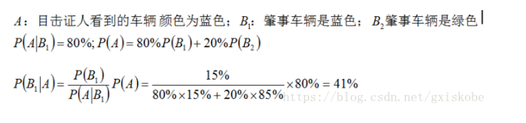

# 智力题

## 1.蓝绿车

**问题：**蓝色车15辆，绿色车85辆。某人看到一个肇事车认定是蓝色。交警回看现场，在这位置识别车颜色成功概率是80%，失败是20%，问这个人看到识别正确的概率是多少？

**答案：**

设看到蓝色车的事件为A，识别车正确的事件为B

P(A)=P(看到蓝色车，并识别成蓝色)+P(看到绿色车，识别成蓝色)=0.15 * 0.8+ 0.85 * 0.2=0.29；

P(AB)=0.15 * 0.8 =0.12

P(B|A)=P(AB)/P(A)=12/29



___

## 2. 三人三鬼过桥

```
0.  人人人 鬼鬼鬼  河
1.  人人人 鬼     河   鬼鬼
2.  人人人 鬼鬼    河   鬼
3.  人人人        河   鬼鬼鬼
4.  人人人 鬼    河   鬼鬼
5.  人鬼        河     人人 鬼鬼
6.  人人鬼鬼     河    人鬼
7.  鬼鬼        河    人人人鬼
8.  鬼鬼鬼       河    人人人
9.  鬼          河    人人人鬼鬼
10.  鬼鬼       河      人人人鬼
11.            河     人人人鬼鬼鬼
```

___

## 3.马赛跑

### 25匹马5条跑道找最快的3匹马 7

将25匹马分成ABCDE5组，假设每组的排名就是A1>A2>A3>A4>A5,用边相连，这里比赛5次
第6次，每组的第一名进行比赛，可以找出最快的马，这里假设A1>B1>C1>D1>E1
D1，E1肯定进不了前3，直接排除掉第7次，B1 C1 A2 B2 A3比赛，可以找出第二，第三名所以最少比赛需要7次


### 25匹马5条跑道找最快的5匹马 8~9

### 64匹马8条跑道找最快四匹马  10~11

第一步 全部马分为8组，每组8匹，每组各跑一次，然后淘汰掉每组的后四名，如下图需要比赛8场)


第二步 取每组第一名进行一次比赛，然后淘汰最后四名所在组的所有马，如下图 (需要
比赛1场)


这个时候总冠军已经诞生，它就是A1，蓝域(它不需要比赛了) 。
而其他可能跑得最快的三匹马只可能是下图中的黄域了 (A2,A3,A4,B1,B2,B3,C1,C2,D1.共9匹马)


___

## 4. 随机数生成别的随机数

```c++
// 生成1到5的随机数
int Rand5() {
    return rand() % 5 + 1;
}

// 生成1到7的随机数
int Rand7() {
    int num;
    do {
        // 使用Rand5()生成1到25的随机数
        num = (Rand5() - 1) * 5 + Rand5();
    } while (num > 21); // 拒绝大于21的数字
    return num % 7 + 1;
}

```

___

## 5. 砝码称重，找出最轻的

1. 有一个天平，九个砝码，其中一个砝码比另八个要轻一些，问至少要用天平称几次才能将轻的那个找出来?  至少2次。
   - 第一次，一边3个，哪边轻就在哪边，一样重就是剩余的3个; 
   - 第二次，一边1个，哪边轻就是哪个，一样重就是剩余的那个;至少称2次
2. 十组砝码每组十个，每个砝码都是10g重，但是现在其中有一组砝码每个都只有9g重，现有一个能显示克数的秤，最少称几次能找到轻的那组? 参考回答: 1次
   - 将砝码分组1~10，第一组拿一个，第二组拿两个以此类推。。第十组拿十个放到秤上称出克数x，则y = 550 - x，第y组就是轻的那组。

___

## 6. 空瓶换饮料，最多喝几瓶

1000瓶饮料，3个空瓶子能够换1瓶饮料问最多能喝几瓶?

```c++
int method(int n) {
    std::vector<int> dp(n + 1);  // 定义一个动态数组dp，大小为n+1，用于存储中间结果

    // 初始状态
    dp[0] = 0;  // dp[0]表示没有饮料瓶时，能换得的饮料数为0
    dp[1] = 1;  // dp[1]表示1个饮料瓶时，能换得的饮料数为1
    dp[2] = 2;  // dp[2]表示2个饮料瓶时，能换得的饮料数为2

    for (int i = 3; i <= n; i++) {
        dp[i] = dp[i - 2] + 3;  // 对于每个i（从3开始），计算能换得的饮料数。每两个空瓶可以多换3瓶饮料。
    }

    return dp[n];  // 返回n个空瓶能换得的最大饮料数
}

```

___

## 7.毒药毒白鼠，找出哪个瓶子中是毒药

有1000个一模一样的瓶子，其中有999瓶是普通的水，有1瓶是毒药。任何喝下毒药的生命都会在一星期之后死亡。现在你只有10只小白鼠和1个星期的时间，如何检验出哪个瓶子有毒药?

```
使用老鼠测试有毒药品，其中1000瓶药品通过二进制数和老鼠的编号进行对应测试。

首先，考虑到1000瓶药品，可以用10位二进制数表示，因为\(2^{10} = 1024\)，足以覆盖1000个数值。例如，药品的编号从1到1000可以这样表示：

- 第一瓶: 00 0000 0001
- 第二瓶: 00 0000 0010
- 第三瓶: 00 0000 0011
- ...
- 第999瓶: 11 1111 0010
- 第1000瓶: 11 1111 0011

实验需要10只老鼠，每只老鼠代表一个二进制位，从低位到高位分别编号为ABCDEFGHIJ。如果某一位上的数字为1，则给相应编号的老鼠喝该瓶药。通过观察哪些老鼠死亡，可以确定有毒药品的编号。例如，如果死去的老鼠编号为ACFGJ，则相应的二进制位为10 0110 0101，这表示编号为613号的药品是有毒的，前提是这种测试方式不会对老鼠造成过大的伤害。
```

___

## 8. 利用烧绳子计算时间

不均匀的绳子燃烧作为计时工具。每根绳子烧完需要一个小时，但因为它们是不均匀的，所以不能简单地通过长度来判断燃烧时间。下面是如何利用这些绳子准确计时15分钟、30分钟、45分钟和75分钟的具体方法：

### 计算15分钟
要计时15分钟，可以将一根绳子对折，然后同时点燃两头。因为绳子是不均匀的，单独点燃一头无法保证在30分钟内烧完半根绳子，但如果两头同时点燃，总的燃烧时间将是30分钟。当两端的火焰相遇时，即为15分钟。

**注意**：这种方法要求对折后的绳子要捆绑得足够紧密，以确保火焰在绳子的中点相遇。如果绳子松散，会影响精确性。

### 计算30分钟
将一根绳子的两头同时点燃。因为两头火焰同时燃烧，会在30分钟时烧完整根绳子。

### 计算45分钟
使用两根绳子：
1. 第一根绳子从两头点燃，这将在30分钟内烧完。
2. 同时点燃第二根绳子的一头。当第一根绳子烧完时，立即将第二根绳子的另一头也点燃。由于第二根绳子此时已经烧了30分钟，点燃另一头后将在15分钟内烧完。总共计时45分钟。

### 计算75分钟
结合30分钟和45分钟的计时方法：
1. 点燃一根绳子的两头进行30分钟计时。
2. 同时，使用另一根绳子按45分钟的计时方法（详见上文）。

___

## 9.在24小时里面时针分针秒针可以重合几次

在 24 小时内，也就只有两次重合，分别为 0 点和12 点。

___

## 10. 100个奴隶猜帽子颜色

一百个奴隶站成一纵列，每人头上随机带上黑色或白色的帽子，各人不知道自己帽子的颜色，但是能看见自己前面所有人帽子的颜然后从最后一个奴隶开始，每人只能色.用同一种声调和音量说一个字:“黑”或白”，如果说中了自己帽子的颜色，就存活，说错了就拉出去斩了，说的参考回答所有奴隶都能听见。是否说对，其他奴隶不知道。在这之前，所有奴隶可以聚在一起商量策略，问如果奴隶都足够聪明而且反应足够快，100个人最大存活率是多少?

```
参考回答: 这是一道经典推理题
1、最后一个人如果看到奇数顶黑帽子报黑”否则报“白”，他可能死
2、其他人记住这个值 (实际是黑帽奇偶数)，在此之后当再听到黑时，黑帽数量减
3、从倒数第二人开始，就有两个信息: 记住的值与看到的值，相同报”白”，不同报
99人能100%存活，1人50%能活
```

**变种**

每个奴隶只能看见前面一个人帽子颜色又能最多存活多少人?

```
参考回答: 增加限制条件后，上面的方法就失效了，此时只能约定偶数位奴隶说他前一个人的帽子颜色，奇数奴隶获取信息100%存活，偶数奴隶50几率存活
```

___

## 11.小猴子搬香蕉

一个猴子身带100个香蕉，他距离家50米。这个猴子要带香蕉回去，但是他一次最多只能背50个香蕉，而且，每走一米他就要吃掉一个香蕉（往 回走也要吃香蕉）。这个猴子最后最多可以带多少个香蕉到家？

题解

这题的思路是这样的，由于一次只能最多只能背50个，总共100个，最少需要2次才能背完，而如果一次把50个背回家，因为距离是50m，离家49m的时候还有49个，48m的时候还有48个，以此类推，离家2m的时候还有两个，到家就没了，可以看到离家越近，背的其实越少，对于最大可以背50个的容量来说，这是一个比较大的浪费，所以可行解必然是先将50个运到中间的某个位置，然后回去将剩余的50个再运到这个位置，使得从这个位置再出发时的香蕉最好能达到50个，因为这样就可以在这个位置一次将50个香蕉运回家，设中间位置距离开始位置为  x ，中间位置距离家为 y ，则 x+y = 50,第一次将50个香蕉运到 x 位置，需要吃掉 x 个香蕉，然后回到出发位置又需要吃掉 x  个香蕉，然后将剩余的50个香蕉运到 x 位置，再吃掉 x 个香蕉，这个过程吃掉了 3x 个香蕉，前面说过，这个位置剩余的香蕉数最好是  50个，因为这样可以一次性将最多的香蕉运回家，所以按照剩余的香蕉数可以列方程 100 - 3x = 50 ，x = 50 / 3，向上取整  x = 17（如果不向上取整，那么运到 x 位置的香蕉总数会超过50个），则y = 50 -x = 33，在 x 处剩余的香蕉总数为100  - 3 * 17 = 49个，再走y = 33m，又要吃掉33个，到家就剩下49 - 33 = 16个了。

```c++
#include <cmath>
#include <iostream>

// 计算最大剩余香蕉数量的函数
int getMaxBananas(int totalBananas = 100, int distanceToHome = 50, int maxCarryCapacity = 50, int eatPerMeter = 1) {
    // 计算每次运输消耗，来回两次
    int optimalX = std::ceil((double)(totalBananas - maxCarryCapacity) / (3 * eatPerMeter));
    if (optimalX < 0) optimalX = 0;  // 保证不小于0
    int y = distanceToHome - optimalX;

    // 在中途停止点X处的香蕉数量
    int remainingAtX = totalBananas - 3 * optimalX * eatPerMeter;
    if (remainingAtX < 0) remainingAtX = 0;  // 避免负数剩余

    // 在家的香蕉数量
    int finalRemaining = remainingAtX - y * eatPerMeter;
    if (finalRemaining < 0) finalRemaining = 0;  // 避免负数结果

    return finalRemaining;
}

int main() {
    // 测试函数
    std::cout << "Max remaining bananas: " << getMaxBananas() << std::endl;
    return 0;
}

```

___

## 12.高楼扔鸡蛋

有2个鸡蛋，从100层楼上往下扔，以此来测试鸡蛋的硬度。比如鸡蛋在第9层没有摔碎，在第10层摔碎了，那么鸡蛋不会摔碎的临界点就是9层
问: 如何用最少的尝试次数，测试出鸡蛋不会摔碎的临界点?

### 暴力法

把其中一个鸡蛋，从第1层开始往下扔。如果在第1层没碎，换到第2层扔;如果在第2层没碎，换到第3层扔......t.如果第59层没碎，换到第60层扔; 如果第60层碎了，说明不会摔碎的临界点是第59层。
在最坏情况下，这个方法需要扔100次

### 二分法

采用类似于二分查找的方法，把鸡蛋从一半楼层 (50层) 往下扔。
如果第一枚鸡蛋，在50层碎了，第二枚鸡蛋，就从第1层开始扔，一层一层增长，直扔到第49层
如果第一枚鸡蛋在50层没碎了，则继续使用二分法，在剩余楼层的一半 (75层) 往下扔..
这个方法在最坏情况下，需要尝试50次。

### 均匀法

如何让第一枚鸡蛋和第二枚鸡蛋的尝试次数，尽可能均衡呢?
很简单，做一个平方根运算，100的平方根是10.
因此，我们尝试每10层扔一次，第一次从10层扔，第二次从20层扔，第三次从30层......一直扔到100层
这样的最好情况是在第10层碎掉，尝试次数为 1 +9 10次。
最坏的情况是在第100层碎掉，尝试次数为 10 + 9 =19次。
不过，这里有一个小小的优化点，我们可以从15层开始扔，接下来从25层、35层扔.....一直到95层
这样最坏情况是在第95层碎掉，尝试次数为 9 + 9 18次

### 动态规划

```c++
#include <vector>
#include <climits>
using namespace std;

class Solution {
public:
    int twoEggDrop(int n) {
        // 创建 dp 数组，其中 dp[0][i] 表示只有一个鸡蛋时，探测 i 层需要的最小次数
        // dp[1][i] 表示有两个鸡蛋时，探测 i 层需要的最小次数
        vector<vector<int>> dp(2, vector<int>(n + 1, INT_MAX));

        // 初始化条件：0 层楼不需要测试
        dp[0][0] = dp[1][0] = 0;

        // 只有一个鸡蛋时，需要逐层测试，因此次数等于楼层数
        for (int i = 1; i <= n; ++i) {
            dp[0][i] = i;
        }

        // 使用两个鸡蛋时的情况
        for (int i = 1; i <= n; ++i) {
            // 尝试在第 j 层扔下鸡蛋
            for (int j = 1; j <= i; ++j) {
                // 确定最坏情况下的最小操作次数
                dp[1][i] = min(dp[1][i], max(dp[0][j - 1] + 1, dp[1][i - j] + 1));
            }
        }

        // 返回两个鸡蛋探测 n 层需要的最小次数
        return dp[1][n];
    }
};

```

压缩状态

```c++
#include <vector>
#include <climits>
using namespace std;

class Solution {
public:
    int twoEggDrop(int n) {
        // dp[i] 表示有两个鸡蛋测试 i 层楼所需的最少次数
        vector<int> dp(n + 1, INT_MAX);
        // 当楼层数为 0 时，不需要进行测试
        dp[0] = 0;

        // 遍历楼层从 1 到 n
        for (int i = 1; i <= n; ++i) {
            // 在这一层中尝试每一层 j 丢下鸡蛋
            for (int j = 1; j <= i; ++j) {
                // 更新当前楼层的最小尝试次数，考虑鸡蛋在 j 层丢下后碎或不碎的情况
                dp[i] = min(dp[i], max(j, dp[i - j] + 1));
            }
        }
        // 返回测试 n 层楼所需的最少次数
        return dp[n];
    }
};

```

N个鸡蛋

```c++
#include <vector>
using namespace std;

class Solution {
public:
    int superEggDrop(int k, int n) {
        // 创建一个二维数组 dp，其中 dp[eggs][trials] 表示有 eggs 个鸡蛋和 trials 次尝试机会时，可以测试的最高楼层。
        vector<vector<int>> dp(k + 1, vector<int>(n + 1, 0));
        
        // 使用 trial 从 1 开始直到 n，表示尝试次数。
        for (int trial = 1; trial <= n; ++trial) {
            // 遍历所有的鸡蛋数量从 1 到 k。
            for (int eggs = 1; eggs <= k; ++eggs) {
                // 根据状态转移方程更新 dp 数组。dp[eggs][trial] 等于下面楼层的测试加上上面楼层的测试再加上这一层楼。
                dp[eggs][trial] = dp[eggs][trial - 1] + dp[eggs - 1][trial - 1] + 1;
                // 如果当前的 dp[eggs][trial] 值已经能覆盖全部楼层 n，就返回当前尝试次数 trial。
                if (dp[eggs][trial] >= n) {
                    return trial;
                }
            }
        }
        // 如果尝试次数用尽还不能覆盖 n 层楼，理论上不会发生，返回 n。
        return n;
    }
};

```


___

## 13.火枪手决斗，谁活下来的概率大?

问题: 彼此痛恨的甲、乙、丙三个枪手准备决斗。甲枪法最好，十发八中;乙枪法次之，十发六中;丙枪法最差，十发四中。如果三人同时开枪，并且每人每轮只发一枪;那么枪战后，谁活下来的机会大一些?

甲、乙、丙三名枪手因彼此痛恨而决定决斗。每人的射击命中率依次为80%、60%、40%。通常认为射击最准的甲存活几率最高，然而策略分析显示，射击最差的丙存活几率实际上最高。

分析各个枪手的策略：
- 甲首先射击乙，因乙对甲的威胁大于丙。
- 乙的最佳策略是先射击甲，以提高其对抗丙时的胜算。
- 丙也应先射击甲，因甲的高命中率。

通过概率计算得出的存活几率：
- 甲的存活几率为24%，这是基于乙和丙合力攻击甲的概率计算。
- 乙存活几率为20%，主要因为甲的高命中率。
- 丙的存活几率为100%，因为丙在首轮中不是直接目标。

这一分析基于所有人了解对方的射击准确率。如果不存在这种信息对称，如甲能够掩饰自己的射击技能，甲可能成为最终幸存者。

这段文字描述了一场涉及甲、乙、丙三名枪手的射击决斗的几种可能结果及其存活概率的计算。下面是对该段落的整理和简化说明：

### 情况分析
- **情况1**: **甲活乙死**
  - 概率: \(24\% \times 80\% = 19.2\%\)
  - 对决: 甲射丙，丙射甲
  - 结果: 甲的存活率为60%，丙的存活率为20%。

- **情况2**: **甲死乙活**
  - 概率: \(20\% \times 76\% = 15.2\%\)
  - 对决: 乙射丙，丙射乙
  - 结果: 乙的存活率为60%，丙的存活率为40%。

- **情况3**: **甲乙同活**
  - 概率: \(24\% \times 20\% = 4.8\%\)
  - 结果: 重复第一轮射击。

- **情况4**: **甲乙同死**
  - 概率: \(76\% \times 80\% = 60.8\%\)
  - 结果: 枪战结束，丙自动存活。

### 存活率计算
- **甲的存活率**
  - \(19.2\% \times 60\% + 4.8\% \times 24\% = 12.672\%\)
- **乙的存活率**
  - \(15.2\% \times 60\% + 4.8\% \times 20\% = 10.08\%\)
- **丙的存活率**
  - \(19.2\% \times 20\% + 15.2\% \times 40\% + 4.8\% \times 100\% + 60.8\% \times 100\% = 75.52\%\)

___

## 14. 先手必胜的问题

100本书，每次能够拿1-5本，怎么拿能保证最后一次是你拿?

以下是详细的策略步骤：

1. **初始控制**：你首先拿4  **(100%(5+1))**本书。这样，剩余的书的数量变为96本。

2. **循环博弈**：从这点开始，每次对手拿了\(N\)本书（其中\(N\)可以是1到5的任意数），你就应该拿\(6-N\)本书。通过这种方式，你和对手每轮共拿走6本书。

3. **维持循环**：通过这种拿书策略，无论对手如何拿书，总数始终保持在每轮减少6本的节奏。因此，在剩下6本书的时候，由于是你的回合，你可以通过选择拿掉所有剩余书籍来结束游戏。

4. **最后阶段**：当书籍总数剩下6本时，无论对方拿走多少本（1到5本），你都可以在下一次轮到你时拿走所有剩余的书籍，从而确保你拿到最后一本书。

这种策略的关键在于初始阶段的拿取（首先拿4本），以及后续确保每一轮你和对方总共拿掉6本书。这样可以保证当书的总数减少到最后的6本时，能够完全控制游戏的结束。通过这种方法，你可以确保无论对手如何操作，最终胜利都将属于你。

___

## 15. 掰巧克力问题或者参加辩论赛

### 问题1: 掰巧克力问题
**问题描述**：
给定一块 \(N \times M\) 的巧克力板，每次可以掰一行或一列，问将巧克力完全掰成 \(1 \times 1\) 块的最小掰断次数是多少？

**答案**：
每次掰断巧克力将它分成两块，要将一块 \(N \times M\) 的巧克力完全分解成 \(1 \times 1\) 块，需要进行 \(N \times M - 1\) 次掰断。这是因为每掰一次巧克力块数增加一块，要从一块掰到 \(N \times M\) 块，需要增加 \(N \times M - 1\) 块。

### 问题2: 辩论赛安排问题
**问题描述**：
1000个人参加辩论赛，采用1对1赛制，输的选手淘汰，问需要安排多少场比赛才能决出胜者？

**答案**：
每场比赛中有一个选手被淘汰，最后剩下一个胜利者。因此，要从1000个选手中决出一个胜者，需要进行 \(1000 - 1 = 999\) 场比赛。每场比赛减少一个参赛者，直到只剩一个胜者。

___

## 16. N只蚂蚁走树枝，问总距离或者总时间

问题: 放N只蚂蚁在一条长度为M树枝上，蚂蚁与蚂蚁之间碰到就各自往反方向走，问总距离或者时间为多少?

### 简化解释：
- **碰撞的忽略**：当两只蚂蚁相遇并“碰撞”时，它们改变方向继续行进。但从计算总时间和距离的角度看，可以假设它们并没有相遇，而是穿过了彼此继续各自的路径。这是因为每只蚂蚁的速度和方向改变前后对于它们到达树枝端点的时间没有实际影响。

- **独立移动**：每只蚂蚁可以视为独立于其他蚂蚁移动到树枝的端点。这意味着我们不需要关注蚂蚁之间的相互作用，只需要考虑它们从起始点到树枝端点的直线距离和速度。

### 计算方法：
- **确定离开时间**：对于每只蚂蚁，确定其到最近端点的直线距离。例如，如果一只蚂蚁位于树枝的某点，向左端点的距离是 \(d_1\)，向右端点的距离是 \(d_2\)，则这只蚂蚁离开树枝的时间取决于它朝哪个方向和哪个端点更近。

- **总时间计算**：如果问题问的是所有蚂蚁离开树枝所需的总时间，你只需考虑最后一只离开的蚂蚁，因为这将决定所有蚂蚁都已离开的时间点。所以，找到所有蚂蚁中离其最近端点最远的那个时间。

通过这种方法，你可以轻松计算出所有蚂蚁离开树枝所需的时间，而不必深入考虑它们之间的相互作用细节。这种模型大大简化了问题的复杂性。

## 17. N个强盗分配M个金币，求方案使得自己分配最多

1. 这个问题是关于N个海盗如何分配M枚金币的问题，具体这里有5个海盗和100枚金币。这个问题旨在通过每个海盗都足够聪明并追求最大利益的前提下，探索如何制定最优的金币分配方案。

   ### **问题背景**
   五个海盗抢到了100枚金币。他们通过抽签决定自己的号码（1到5），然后依次提出分配方案，需要超过半数的海盗同意才能执行，否则提案者会被扔入大海喂鲨鱼。

   ### **分配策略**

   - **从后向前推理：**
     如果只剩下最后两名海盗（4号和5号），5号将反对任何4号的提议，以便独吞所有金币。因此，4号为了生存，会支持3号的提议。
     
   - **3号的提案**：
     知道4号需要他的支持才能生存，3号会提出将所有100枚金币归自己所有，因为他知道即使自己给4号0枚金币，4号为了不被扔进海里也会支持他。
     
   - **2号的提案**：
     为了获得4号和5号的支持，2号提出给4号和5号各1枚金币，自己则拿走98枚。这比在3号的提案下4号和5号能得到的更有利，所以他们会支持2号。
     
   - **1号的最优提案**：
     1号了解到上述所有情况后，将提出给3号1枚，给4号或5号2枚，自己则保留97枚。这样3号和4号（或5号）都得到了比其他提案更多的金币，足以保证1号的提案获得通过。

   ### **结论**
   在这种设置下，1号海盗可以通过精心设计的提案保证自己得到最多的金币（97枚），同时确保自己的生存。

   ### **变种情况**
   如果规则是只需要半数海盗同意，1号海盗的策略需要调整为给3号和5号各1枚金币，自己则可以拿走98枚金币。这确保了即使在只需要半数同意的情况下，他也能通过自己的提案。

   这个问题展示了逆向思维和战略规划在决策过程中的重要性，特别是在涉及博弈论和个人最大化策略的场景中。