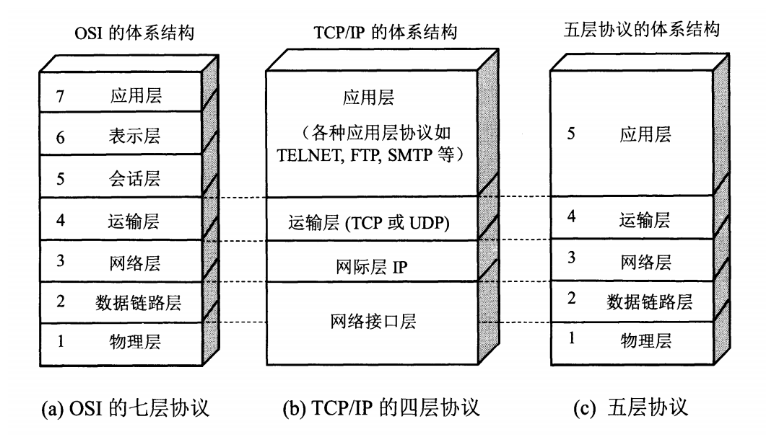

## 体系结构

___

### 结构图

### 各层的作用及协议

| 分层       | 作用                                             | 协议                                                |
| ---------- | ------------------------------------------------ | --------------------------------------------------- |
| 物理层     | 通过媒介传输比特，确定机械及电气规范（比特 Bit） | RJ45、CLOCK、IEEE802.3（中继器，集线器）            |
| 数据链路层 | 将比特组装成帧和点到点的传递（帧 Frame）         | PPP、FR、HDLC、VLAN、MAC（网桥，交换机）            |
| 网络层     | 负责数据包从源到宿的传递和网际互连（包 Packet）  | IP、ICMP、ARP、RARP、OSPF、IPX、RIP、IGRP（路由器） |
| 运输层     | 提供端到端的可靠报文传递和错误恢复（ 段Segment） | TCP、UDP、SPX                                       |
| 应用层     | 允许访问OSI环境的手段（应用协议数据单元 APDU）   | FTP、DNS、Telnet、SMTP、HTTP、WWW、NFS              |

## 物理层

___

### 传输方式：

- **传输数据的单位**：比特（Bit）
- **数据传输系统**：源系统（源点、发送器） --> 传输系统 --> 目的系统（接收器、终点）

### **通道类型**：

1. **单向通道（单工通道）**：只支持单向通信，没有反方向交互。例如，广播电视信号的传输。
2. **双向交替通信（半双工通信）**：通信双方都可以发送和接收消息，但不能同时进行。例如，对讲机。
3. **双向同时通信（全双工通信）**：通信双方可以同时发送和接收信息。例如，电话通话。

### **通道复用技术**：

1. **频分复用（FDM，Frequency Division Multiplexing）**：不同的用户在不同的**频率带宽**内进行通信，所有用户同时占用不同的频带资源。例如，无线电广播中不同的频道。
2. **时分复用（TDM，Time Division Multiplexing）**：不同用户在同一频带上分别在不同**时间片**进行通信，所有用户轮流占用同样的频带宽度。例如，数字多路电话系统。
3. **波分复用（WDM，Wavelength Division Multiplexing）**：是光纤通信中的频分复用，不同的用户使用不同的**光波长**。例如，在单根光纤中传输多个光信号。
4. **码分复用（CDM，Code Division Multiplexing）**：不同的用户使用不同的**编码方式**，可以同时在同一频带进行通信。例如，CDMA移动通信技术。

## 数据链路层

___

### 主要信道
1. **点对点信道**：这是两个节点之间的直接连接。
2. **广播信道**：可以同时传输给网络中多个节点。

### 点对点信道
- **数据单元**：帧（Frame）
- **三个基本问题**：
  - **封装成帧**：将网络层的IP数据报封装成帧。例如，使用SOH（Start of Header）标记开始，EOT（End of Transmission）标记结束。
  - **透明传输**：确保任何字符都能被传输。例如，通过字节填充法，即在数据中出现的冲突字符前加入转义字符。
  - **差错检测**：降低误码率（Bit Error Rate, BER）。通常使用循环冗余检测（Cyclic Redundancy Check, CRC）。

- **点对点协议（PPP）**
  - 用户计算机和ISP（Internet Service Provider）通信时使用的协议。

### 广播信道
- **广播通信**：
  - **硬件地址**：也称为物理地址或MAC地址（Media Access Control Address）。
  - **单播（Unicast）帧**：一对一通信，接收方的MAC地址与发送方相同。
  - **广播（Broadcast）帧**：一对全体通信，发送给网络上所有站点。
  - **多播（Multicast）帧**：一对多通信，发送给网络上特定的一组站点。

### 例子

1. **封装成帧的例子**：假设有一个IP数据报需要通过点对点信道发送。首先，这个数据报会被封装在一个帧结构中。这个帧可能包含一个起始标志（如SOH），数据报本身，然后是一个结束标志（如EOT）。

2. **透明传输的例子**：如果帧中的数据部分包含了与结束标志（如EOT）相同的字符，那么这个字符前会加上一个特殊的转义字符，以避免接收方错误地将这个数据字符解释为帧的结束。

3. **差错检测的例子**：在发送帧之前，发送方会计算数据部分的CRC值，并将其作为帧的一部分发送出去。接收方在接收到帧后，会重新计算数据部分的CRC值，与接收到的CRC值进行比较，以检测数据在传输过程中是否发生了变化。

## 网络层

___

### 协议

- IP（Internet Protocol，网际协议）是为计算机网络相互连接进行通信而设计的协议。
- ARP（Address Resolution Protocol，地址解析协议）
- ICMP（Internet Control Message Protocol，网际控制报文协议）
- IGMP（Internet Group Management Protocol，网际组管理协议）

### IP 网际协议

IP 地址分类：

- `IP 地址 ::= {<网络号>,<主机号>}`

| IP 地址类别 | 网络号                                 | 网络范围               | 主机号 | IP 地址范围                  |
| ----------- | -------------------------------------- | ---------------------- | ------ | ---------------------------- |
| A 类        | 8bit，第一位固定为 0                   | 0 —— 127               | 24bit  | 1.0.0.0 —— 127.255.255.255   |
| B 类        | 16bit，前两位固定为 10                 | 128.0 —— 191.255       | 16bit  | 128.0.0.0 —— 191.255.255.255 |
| C 类        | 24bit，前三位固定为 110                | 192.0.0 —— 223.255.255 | 8bit   | 192.0.0.0 —— 223.255.255.255 |
| D 类        | 前四位固定为 1110，后面为多播地址      |                        |        |                              |
| E 类        | 前五位固定为 11110，后面保留为今后所用 |                        |        |                              |

### IP 数据报格式：

### ICMP 网际控制报文协议

ICMP是用于IP主机和路由器之间传递控制消息的协议。控制消息通常用于提供有关网络问题的反馈，而不是直接传递用户数据。

**ICMP 报文格式**：

- 类型（Type）和代码（Code）字段用于区分不同的ICMP消息。
- 校验和（Checksum）用于确保报文在传输过程中的完整性。
- 其他字段依赖于ICMP消息的类型和代码。

**应用**：
- **PING**：使用ICMP回显请求和回显应答报文来测试两个主机之间的连通性。
- **TTL**：用于避免数据包在网络中无限循环。每经过一个路由器，TTL值减一，当TTL值降至零时，数据包被丢弃，并发送ICMP超时报文。

### 内部网关协议

内部网关协议用于同一自治系统（AS）内的路由选择。

- **RIP**：基于距离向量的路由选择协议，使用跳数作为度量标准。
- **OSPF**：基于链路状态的路由选择协议，使用Dijkstra算法计算最短路径。

### 外部网关协议

外部网关协议用于不同自治系统间的路由选择。

- **BGP**：基于路径向量的协议，能有效处理不同自治系统间的路由选择和循环问题。

### IP多播

IP多播用于同时向多个目的地发送数据包。

- **IGMP**：用于在主机和局域网上的多播路由器之间管理多播组成员资格。
- **多播路由选择协议**：负责在网络中创建有效的路径，将数据从发送方发送到多播组的所有成员。

### VPN 和 NAT

- **VPN**：通过在公共网络上创建一个虚拟的私有网络来提供安全连接，常用于企业远程访问。
- **NAT**：将本地网络中的私有地址转换为公共地址，使得多个设备可以共享一个公共IP地址访问互联网，同时提供一定程度的安全性和隐私。

### 路由表包含什么？

1. **网络ID（Network ID）**：
   - 描述：目标地址的网络部分。
   - 示例：如果有一个目标IP地址为`192.168.1.1`，网络ID可能是`192.168.1.0`，表示这是192.168.1网络上的一个地址。
2. **子网掩码（Subnet Mask）**：
   - 描述：用于确定IP地址中哪部分是网络地址，哪部分是主机地址。
   - 示例：对于`192.168.1.0`的网络，子网掩码可能是`255.255.255.0`。这意味着前三个八位字节代表网络部分，最后一个八位字节代表主机部分。
3. **下一跳地址/接口（Next Hop / Interface）**：
   - 描述：指示数据包应该被发送到的下一个网络设备或接口。
   - 示例：如果下一跳是一个特定的路由器，它可能有一个IP地址如`192.168.1.254`；或者，它可以是一个接口，如`eth0`（以太网接口）。

在某些情况下，路由表还可能包含以下附加信息：

1. **花费（Cost）**：
   - 描述：数据包经过路径所需的代价，常用于确定最佳路由。
   - 示例：使用跳数（如在RIP协议中）或带宽（如在OSPF协议中）作为花费指标。
2. **路由的服务质量（Quality of Service, QoS）**：
   - 描述：路由选择可能考虑的服务质量要求，如带宽、延迟等。
   - 示例：对于需要低延迟的视频流量，路由选择可能优先考虑较快的路径。
3. **出/入连接过滤列表**：
   - 描述：规定了哪些数据包可以通过路由器的出口或入口。
   - 示例：防火墙规则可能定义在某个接口上允许或拒绝特定类型的流量。

## 运输层

___

### TCP（Transmission Control Protocol，传输控制协议）

TCP是一种面向连接的、可靠的、基于字节流的传输层通信协议，其传输单位是报文段。

**特征**：

- **面向连接**：在数据传输前需要建立连接。
- **点对点通信**：一对一的通信模式。
- **可靠交互**：通过确认和重传机制保证数据准确送达。
- **全双工通信**：允许数据在两个方向上同时传输。
- **面向字节流**：数据以字节流的形式发送。

**TCP保证可靠传输的机制**：

- **确认和超时重传**：发送方在发送数据后等待确认，未收到确认时进行重传。
- **数据分片和排序**：将大数据块分成小块进行发送，并在接收端进行重新排序。
- **流量控制**：控制发送速率，防止接收方来不及处理。
- **拥塞控制**：根据网络状况调整发送速率。
- **数据校验**：使用校验和确保数据的完整性。

**TCP状态控制码**：

- **URG**：紧急指针字段有效时设为1。
- **ACK**：确认号字段有效时设为1。
- **PSH**：提示接收方立即处理接收到的数据。
- **RST**：出现错误需重新建立连接时设为1。
- **SYN**：连接建立请求或接受时设为1。
- **FIN**：连接释放时设为1。

### UDP（User Datagram Protocol，用户数据报协议）

UDP是一种无连接的传输层协议，提供简单、不可靠的信息传送服务，其传输单位是用户数据报。

**特征**：

- **无连接**：发送数据前不需要建立连接。
- **尽最大努力交付**：不保证数据送达。
- **面向报文**：保持报文边界，发送方发送的是什么，接收方接收的就是什么。
- **无拥塞控制**：不对数据传输进行拥塞控制。
- **支持多种通信方式**：支持一对一、一对多、多对一、多对多的交互通信。
- **首部开销小**：相较于TCP，UDP的首部开销更小。

#### 常用网络端口

| 应用程序 | FTP  | TELNET | SMTP | DNS  | TFTP | HTTP | HTTPS | SNMP |
| -------- | ---- | ------ | ---- | ---- | ---- | ---- | ----- | ---- |
| 端口号   | 21   | 23     | 25   | 53   | 69   | 80   | 443   | 161  |

### TCP 与 UDP 的区别

1. **连接方式**：
   - **TCP**：面向连接，必须先建立连接才能通信。
   - **UDP**：无连接，数据可以直接发送。

2. **可靠性**：
   - **TCP**：提供可靠的服务，确保数据准确无误地传输。
   - **UDP**：尽最大努力交付，但不保证数据的可靠性。

3. **通信方式**：
   - **TCP**：全双工通信，提供稳定的连接通道。
   - **UDP**：不区分发送方和接收方的状态，不确保通信质量。

4. **应用场景**：
   - **TCP**：适用于要求高可靠性的应用，如网页浏览、文件传输。
   - **UDP**：适用于实时应用，如视频会议、在线游戏。

5. **数据传输方式**：
   - **TCP**：面向字节流，发送方和接收方需处理黏包问题。
   - **UDP**：面向报文，保持消息边界，不会出现黏包问题。

6. **拥塞控制**：
   - **TCP**：有拥塞控制机制，防止网络拥堵。
   - **UDP**：无拥塞控制，网络拥堵不会影响发送速率。

7. **头部开销**：
   - **TCP**：首部至少20字节，较大的开销。
   - **UDP**：首部固定8字节，开销较小。

### TCP 黏包问题

#### **原因**：

- **字节流特性**：TCP是基于字节流的传输服务，在发送和接收数据时，没有固定边界，因此可能导致数据包在接收时黏连在一起。

#### **解决方案**：

1. **发送定长包**：固定每个数据包的长度，接收方根据这个长度进行数据包的辨识和分割。
2. **包头包含长度信息**：在包头部分加入长度信息，接收方先读取长度信息，再根据这个长度读取相应的数据。
3. **特殊符号作为边界**：在数据包之间加入特殊字符（如`\r\n`）作为分隔符。注意：数据本身包含这些特殊字符时可能需要特殊处理。
4. **应用层协议规定**：采用更复杂的应用层协议来明确数据的开始和结束，如HTTP协议。

#### 例子

想象你正在用微信和朋友聊天。你连续发了几条短消息，但由于网络的原因，这些消息可能会一起到达，让你的朋友一次性收到一个长消息，这就是所谓的“黏包”。

这是因为 TCP 是一个面向字节流的协议，它并不关心消息的界限，只是把传输的内容看作一连串的字节。所以，当你发送多条消息时，TCP可能会把它们视作一整块数据来处理和发送。

如何解决：

1. **固定长度**：每条消息固定为同一长度。
2. **分隔符**：在每条消息的末尾加入特殊字符来区分，如换行符。
3. **包头加长度**：在消息的开始加上一个表示消息长度的头部。

### TCP 流量控制

#### 概念
流量控制是TCP协议的一个特性，其主要目的是确保发送方不会因发送数据太快而使接收方不堪重负。流量控制基于接收方的处理能力和可用缓存空间来调整发送方的发送速率。

#### 方法
主要方法是利用**可变窗口**进行控制，这被称为**滑动窗口协议**。滑动窗口的大小根据接收方的接收缓冲区空间动态调整，确保发送方的发送速率与接收方的处理能力保持一致。

#### 例子

流量控制就像是你和你朋友之间的对话。如果你说话太快，你的朋友可能听不过来。相反，如果你说话太慢，对话就会变得拖沓。

TCP 使用一种叫做“滑动窗口”的机制来控制这个“说话的速率”。窗口大小就是在一定时间内可以发送的数据量。如果接收方处理得快，窗口就会变大，发送方就可以发送更多的数据。如果接收方处理得慢，窗口就会变小，发送方就会减慢发送速度。

### TCP 拥塞控制

##### 概念
拥塞控制是为了防止过多的数据注入网络而导致网络拥堵。其目的是通过调节网络中的数据传输，避免路由器或链路过载，保持网络的稳定性。

##### 方法
TCP实现拥塞控制的主要方法有：

1. **慢开始（Slow Start）**：
   - 刚开始发送数据时，窗口大小从1或较小的值开始，逐渐增加，以避免突然发送大量数据。

2. **拥塞避免（Congestion Avoidance）**：
   - 当窗口大小超过某个阈值后，逐渐减缓窗口增长的速度，以避免拥塞。

3. **快重传（Fast Retransmit）**：
   - 当发送方接收到连续的重复确认时，立即重传丢失的数据包，而不是等待超时。

4. **快恢复（Fast Recovery）**：
   - 在快重传后，减小但不是减半窗口大小，快速恢复到合适的发送速率。

#### 例子

拥塞控制类似于交通控制。想象一下，如果每辆车（数据包）都不考虑其他车辆，只是尽快地往前冲，那么道路（网络）很快就会拥堵。

TCP 通过几种机制来防止这种情况：

1. **慢开始**：就像是车辆从静止开始逐渐加速，TCP 初始时限制数据包的发送速率，逐渐增加直至找到网络的最佳容量。
2. **拥塞避免**：当网络接近其容量时，TCP 会小心地增加或减少其发送速率，就像是司机在繁忙的道路上小心驾驶。
3. **快速重传和快速恢复**：如果发现有数据包丢失（比如司机看到前面发生了事故），TCP 会迅速减速（重传丢失的数据包）然后再慢慢恢复正常速度。

### TCP 三次握手（建立连接）

想象一下，你（客户端）想要通过电话与朋友（服务器）进行一次长谈。在开始深入交流之前，你们两个需要先确认彼此都准备好了。

1. **第一次握手**：你拨通电话，告诉你的朋友：“嘿，我想和你说话。”（客户端发送SYN）

2. **第二次握手**：你的朋友接听电话，回应说：“好的，我这边准备好了，你准备好了吗？”（服务器回应SYN+ACK）

3. **第三次握手**：你回答：“是的，我准备好了，让我们开始吧。”（客户端发送ACK）

这个过程就像是在确认双方都准备好进行对话。三次握手可以确保双方都准备好了接收和发送信息，这样就可以开始稳定的通信了。

### TCP 四次挥手（断开连接）

当你们的谈话结束后，你们需要挂断电话。但由于你们都可能在任何时间结束对话，所以结束通话的流程涉及四个步骤。

1. **第一次挥手**：假设你先想结束通话，你说：“我说完了。”（客户端发送FIN）

2. **第二次挥手**：你的朋友回应：“好的，我知道了。”（服务器发送ACK），但他可能还有些话要说。

3. **第三次挥手**：过了一会儿，你的朋友也准备结束通话，他说：“我也说完了。”（服务器发送FIN）

4. **第四次挥手**：你回应：“好的，再见。”（客户端发送ACK），然后等待一段时间确保他收到你的回应，再挂断电话。

这个过程确保了你和你的朋友都能清楚地表示通话已经结束，避免了对方还有未说完的话就急忙挂断电话的情况。在这个过程中，双方都有机会确保所有要说的话都已经说完，并且对方也清楚地知道通话已经结束。

## 应用层

### DNS（Domain Name System）

- **功能**：将域名和IP地址相互映射，使人们可以使用容易记忆的域名来访问网站。
- **端口**：使用TCP和UDP端口53。
- **域名限制**：每级域名最长63个字符，总长度不超过253个字符。
- **示例**：域名结构如`blog.huihut.com`，包括三级域名、二级域名和顶级域名。

### FTP（File Transfer Protocol）

- **功能**：标准网络协议，用于在客户端和服务器之间传输文件。
- **模式**：使用客户/服务器模式，**基于TCP实现**，提供交互式访问和双向传输。

### TFTP（Trivial File Transfer Protocol）

- **功能**：简单文件传输协议，用于小型文件传输。
- **特点**：**使用UDP**进行数据传输，功能较FTP简单，不支持交互式会话和用户身份验证。

### TELNET

- **功能**：标准协议和主要方法，用于实现远程登录服务。
- **特点**：允许用户在本地计算机上完成远程主机工作。

### HTTP（HyperText Transfer Protocol）

- **功能**：超文本传输协议，是万维网的数据通信基础。
- **特点**：用于从WWW服务器传输超文本到本地浏览器。

### SMTP（Simple Mail Transfer Protocol）

- **功能**：简单邮件传输协议，用于电子邮件的发送。
- **特点**：控制信件的传输方式，帮助计算机识别下一个邮件的目的地。

### Socket 编程

- **定义**：网络通信的编程接口，基于TCP/IP协议封装。
- **功能**：提供程序员进行网络开发的接口。

### WWW（World Wide Web）

- **定义**：由众多互相链接的超文本组成的系统。
- **访问方式**：通过互联网访问。

### URL（Uniform Resource Locator）

- **定义**：互联网上**资源的统一定位符。**
- **格式**：包括协议类型、服务器地址、端口号、资源路径、查询参数和片段ID等。

### HTTP方法和状态码

- **请求方法**：如GET（请求页面）、POST（提交数据）、DELETE（删除资源）等。
- **状态码**：1xx（信息性状态），2xx（成功），3xx（重定向），4xx（客户端错误），5xx（服务器错误）。

### 其他协议

- **SMTP**：用于电子邮件传输。
- **DHCP**：动态分配IP地址和管理网络配置。
- **SNMP**：用于网络设备的管理和监控。

## 基础概念面试题

___

参考[计算机网络面试题（含答案） - 知乎 (zhihu.com)](https://zhuanlan.zhihu.com/p/138272238)

### (1) OSI七层模型和TCP/IP五层模型

**OSI七层模型**：

1. **应用层**：提供网络服务给应用程序（如Web浏览、电子邮件）。
2. **表示层**：处理数据的格式转换，压缩和加密。
3. **会话层**：负责建立、维护和断开通信。
4. **传输层**：负责为数据提供端到端的传输。
5. **网络层**：处理数据的寻址和路由。
6. **数据链路层**：定义通过媒介连接的设备之间的数据传输。
7. **物理层**：涉及物理设备和传输媒介。

**TCP/IP五层模型**：
1. **应用层**：合并了OSI模型的应用层、表示层和会话层，处理所有高级协议。
2. **传输层**：与OSI模型相同，负责数据的端到端传输。
3. **网络层**：与OSI模型相同，处理数据寻址和路由。
4. **数据链路层**：与OSI模型相同，定义数据的物理传输。
5. **物理层**：与OSI模型相同，涉及物理设备和传输媒介。

### (2) 面向连接型和面向无连接型传输

**面向连接型传输**：
- 类似于打电话，需要先建立连接，然后进行通话，最后挂断电话。
- 包含了建立连接、数据传输、断开连接的全过程。
- 强调传输的可靠性，例如，如果数据丢失了，会重新发送。
- 典型例子是TCP协议，它保证数据准确、可靠地到达。

**面向无连接型传输**：
- 像发短信，你发送消息但不需要先建立连接。
- 只负责发送数据，不保证数据的可靠到达。
- 发送方可以随时发送数据，即使接收方不可用或不存在。
- 一个常见的例子是UDP协议，它简单快速，但不保证数据的完整性或顺序。

#### (3) UDP和TCP及其区别

**UDP（User Datagram Protocol）**：
- 类似于发短信，直接发送数据，不需要建立连接。
- 提供最基础的数据传输功能，不保证可靠性、顺序和数据完整性。
- 适用于那些不要求可靠传输的应用，如流媒体。

**TCP（Transmission Control Protocol）**：
- 类似于打电话，需要先建立连接，进行通话，然后再断开连接。
- 提供可靠的数据传输，确保数据准确和按顺序到达。
- 支持一对一通信，具有错误校正、流量控制和拥塞控制机制。

**主要区别**：

- **连接方式**：TCP是面向连接的，而UDP是无连接的。
- **通信方式**：TCP支持一对一，UDP支持多种通信方式（一对一、一对多等）。
- **数据处理**：TCP基于字节流，UDP基于报文。
- **可靠性**：TCP保证数据传输的可靠性，UDP则不保证。

#### (4) TCP和UDP的应用层协议

**TCP的应用层协议**：

- **FTP（File Transfer Protocol）**：用于文件传输。
- **SSH（Secure Shell）**：安全的远程登录。
- **HTTP（HyperText Transfer Protocol）**：用于Web浏览器和服务器之间的数据传输。

**UDP的应用层协议**：

- **DNS（Domain Name System）**：将域名转换为IP地址。
- **TFTP（Trivial File Transfer Protocol）**：简单的文件传输协议。
- **SNMP（Simple Network Management Protocol）**：用于网络设备的管理和监控。

#### (5) TCP三次握手

**三次握手过程**：

1. **第一次握手**：客户端发送SYN（同步序列编号）包到服务器，并进入SYN-SENT状态。
2. **第二次握手**：服务器回应SYN-ACK（同步确认）包，进入SYN-RECEIVED状态。
3. **第三次握手**：客户端再次发送ACK包，一旦服务器接收，连接建立。

**为什么不是两次或四次**：
- **不是两次**：仅两次握手不能确认双方的接收和发送能力都正常。
- **不是四次**：三次已足够同步双方，第四次没有额外信息，会浪费资源。

#### (6) TCP四次挥手

**四次挥手过程**：
1. **第一次挥手**：客户端发送FIN包，请求关闭连接。
2. **第二次挥手**：服务器回应ACK包，确认收到FIN。
3. **第三次挥手**：服务器发送FIN包，请求关闭连接。
4. **第四次挥手**：客户端回应ACK包，确认收到FIN。

**为什么不是三次或五次**：
- **不是三次**：TCP是全双工通信，关闭连接时需单独确认每个方向。
- **不是五次**：四次已足以完成双方关闭连接的确认，更多次是多余的。

#### (7) TIME_WAIT状态和2*MSL

**为什么客户端进入TIME_WAIT状态等待2*MSL**：
1. **确保服务端接收ACK**：客户端发送最后一个ACK后，进入TIME_WAIT状态以确保服务端接收到此ACK。如果服务端未收到，它会重发FIN包，客户端需回应ACK。
2. **消除旧报文**：等待2*MSL时间是为了让当前连接产生的所有报文在网络中消失，防止它们影响后续的连接。

#### (8) ARQ协议

**ARQ协议（Automatic Repeat-reQuest）**：
ARQ协议是一种错误控制方法，用于确保数据正确地从发送方传输到接收方。如果发送方在一定时间内没有收到来自接收方的确认回执，它会重新发送数据。主要有两种类型：停止等待ARQ协议和连续ARQ协议。

1. **停止等待ARQ协议**：
   - 类似于一问一答的交流方式。
   - 发送方发送一个数据包，然后等待接收方的确认。
   - 如果发送方在设定的时间内没有收到确认，它会重新发送同一个数据包。
   - 这种方式简单，但效率不高，因为每次只发送一个数据包。

2. **连续ARQ协议**：
   - 更像是一连串的对话。
   - 发送方可以连续发送多个数据包，而不需要每个包都立即确认。
   - 发送方维护一个“窗口”，包含多个数据包。
   - 接收方不需要对每个数据包单独确认，而是可以一次性确认多个包。
   - 如果某个数据包丢失，接收方可以通知发送方从最后一个正确接收的包重新开始发送。
   - 这种方式提高了数据传输的效率。

### 例子
假设窗口大小为4，发送方发送了1号、2号、3号、4号四个数据包。如果3号包丢失，接收方将确认2号包（最后一个成功接收的包），然后发送方重新发送3号和4号包。这样，即使4号包已经成功发送，也会因为3号包的丢失而被重发。

ARQ协议通过这种错误检测和重传机制，提高了数据传输的可靠性，尤其在不稳定的通信环境中非常有效。连续ARQ协议更进一步，通过允许连续发送多个数据包，显著提高了信道的利用率。

#### (9) TCP的流量控制

**流量控制的目的**：

- 控制发送端的数据发送速度，确保接收端能够成功接收所有报文，避免因为接收端处理不过来而导致数据重传，从而造成网络资源的浪费。

**如何实现**：

- 通过“滑动窗口”机制实现。接收端在TCP报头中指明其能接受的最大数据量（窗口大小），发送端根据这个信息控制其发送的数据量。
- 窗口大小表示接收端的处理能力，越大意味着网络吞吐量越高。

#### (10) TCP的拥塞控制

**拥塞控制的目的**：

- 防止过多数据同时注入网络，避免网络拥塞甚至瘫痪。

**如何实现**：

- 使用策略如慢启动、拥塞避免、快重传和快恢复等。
- **慢启动**：开始时，定义一个小的“拥塞窗口”，随着通信的进行逐渐增大窗口，以控制数据传输的速度。
- 发送端会根据拥塞窗口和接收端的流量控制窗口中的较小值来确定发送数据量。

#### (11) TCP粘包

**粘包的现象**：

- 当客户端连续发送数据包时，服务端接收的数据可能会出现两个或多个数据包粘连在一起的情况。

**为什么会发生粘包**：

- TCP作为一种基于字节流的传输协议，将传输的数据视为无结构的字节流，不保留数据包的边界。
- TCP报头中没有表示数据长度的字段，因此在数据传输过程中，连续的数据包可能会合并为一个数据块。

**粘包的含义**：

- 一个接收的TCP数据包中包含了发送端发送的两个或多个数据包的信息，这就是所谓的粘包现象。

#### (12) 粘包的产生

**发送方产生粘包**：

- 在使用TCP协议时，如果发送的数据很小，TCP可能会启用Nagle算法来合并这些小数据包，以减少网络上的小包数量。
- 这种合并发生在发送缓冲区中，导致实际发送到网络上的数据已经是合并后的结果。
- **简单来说**：如果要发送的数据小于TCP的发送缓冲区大小，TCP会把多次写入缓冲区的数据合并后一次性发送出去，从而产生粘包。

**接收方产生粘包**：

- 在接收方，TCP协议会把接收到的数据放入接收缓冲区，然后由应用层主动读取。
- 如果应用层读取数据的速度不够快，新到达的数据就会附加在缓冲区未读取的数据后面。
- **简单来说**：如果接收数据端的应用层没有及时读取接收缓冲区中的数据，而新的数据又不断到来并被追加到缓冲区末尾，读取时就会出现粘包。

#### (13) 避免粘包的方法

1. **添加特殊字符**：在每个数据包的末尾添加特殊字符，比如换行符或其他标识符，用以区分连续的两个数据包。
2. **添加包长度**：在每个数据包的头部添加该数据包的长度信息，使接收方能够明确知道每个数据包的界限。

## HTTP面试题

___

#### (1) HTTP协议和HTTPS协议的区别

**HTTP协议**：
- HTTP（HyperText Transfer Protocol），即超文本传输协议，用于客户端和服务端之间的通信。
- 数据传输采用明文，不提供数据加密功能。
- 无法验证通信双方的真实身份。
- 不保证数据完整性，容易受到中间人攻击。

**HTTPS协议**：

- HTTPS = HTTP + 加密 + 认证 + 完整性保护。
- 在HTTP的基础上，通过SSL/TLS协议提供数据加密。
- 通过数字证书认证，确认通信双方的身份。
- 保护数据完整性，防止数据在传输过程中被篡改。

#### (2) HTTP协议的无状态性和解决方法

**HTTP协议的无状态性**：
- HTTP是一种无状态协议，不会保存之前的交互状态。
- 设计为无状态是为了快速处理大量事务，提高效率。

**解决方法**：
- 使用Cookie进行状态管理。
- Cookie通过响应报文中的Set-Cookie字段设置，客户端保存这些Cookie信息。
- 客户端再次向服务器发送请求时，会自动在请求中包含这些Cookie。
- 服务器通过Cookie判断是哪个客户端发来的请求，从而恢复之前的会话状态。

#### (3) URI和URL的区别

**URI（Uniform Resource Identifier）**：
- 统一资源标识符，用于唯一标识互联网上的资源。
- 可以是名称、地址或两者的组合。

**URL（Uniform Resource Locator）**：
- 统一资源定位符，一种常见的URI，用于描述一个网络上的资源具体位置。
- 通常所说的网址就是URL。

**区别**：
- URL是URI的子集。
- URI更加抽象和广泛，而URL是具体的资源地址。

#### (4) 常见的HTTP动词

- **GET**：从服务器获取资源。
- **POST**：在服务器新建资源。
- **PUT**：在服务器上更新资源。
- **DELETE**：从服务器上删除资源。
- **HEAD**：获取资源的元数据（如头信息，不包括实体内容）。
- **OPTIONS**：查询服务器对指定资源支持的HTTP方法。

#### (5) PUT和POST的区别

- **PUT**：用于更新服务器上的资源，如果资源不存在则创建。PUT是幂等的，意味着多次执行同一请求的效果与执行一次相同。
- **POST**：用于在服务器上创建新资源。POST不是幂等的，多次执行同一请求可能会创建多个资源。

**幂等性**：
- 幂等性是指一个操作多次执行对系统状态的影响和一次执行相同。

#### (6) HTTP请求报文和响应报文的组成

**HTTP请求报文**：
- **请求行**：包括方法、URI和HTTP版本。
- **请求头**：包含客户端环境信息、请求的身份认证等。
- **空行**：分隔头部和主体。
- **请求体**：数据部分，可选。

**HTTP响应报文**：
- **状态行**：包括HTTP版本、状态码和状态信息。
- **响应头**：包含服务器信息、内容类型等。
- **空行**：分隔头部和主体。
- **响应体**：返回的资源内容。

#### (7) 常见的HTTP返回码

- **200**：请求被正常处理。
- **204**：请求被受理但没有资源可以返回。
- **206**：客户端只请求资源的一部分，服务器执行部分GET。
- **301**：永久性重定向。
- **302**：临时重定向。
- **303**：要求客户端重定向到另一个URI。
- **304**：附带条件的请求不满足条件。
- **307**：临时重定向，要求使用POST方法。
- **400**：请求报文有语法错误。
- **401**：请求需要用户认证。
- **403**：服务器拒绝执行。
- **404**：服务器无法找到请求的资源。
- **500**：服务器内部错误。
- **503**：服务器正忙。

#### （6）在HTTP协议中，判断一个HTTP报文是否结束主要依靠以下几种方法：

1. **内容长度（Content-Length）**: 如果HTTP头部包含`Content-Length`字段，那么它指定了HTTP请求或响应体的确切字节数。因此，可以根据这个长度读取相应数量的字节来确定报文的结束。
2. **分块传输编码（Chunked Transfer Encoding）**: 在HTTP/1.1中，如果报文使用分块传输编码，那么报文的结束由一个长度为0的块表示。每个块开始于它的长度（以十六进制格式），后跟CRLF（回车换行），然后是数据本身，最后再是CRLF。当读取到一个长度为0的块时，表示报文结束。
3. **连接关闭（Connection Close）**: 在某些情况下，如果没有指定`Content-Length`且不是分块传输编码，那么报文的结束由TCP连接的关闭标志。这意味着，读取数据直到连接被对方关闭。